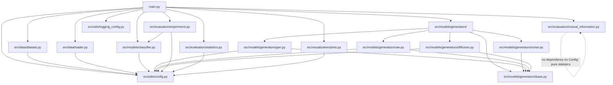
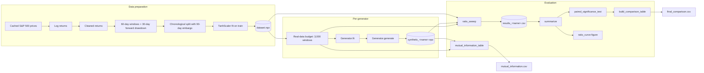
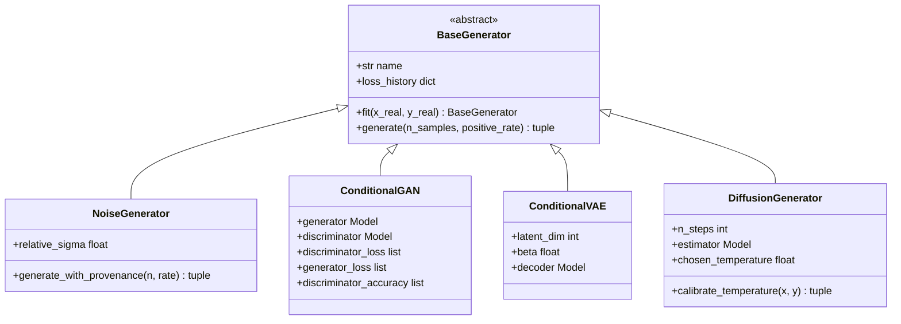

# Architecture

## 1. Project overview

This project studies whether synthetic financial data can improve a
classifier that predicts severe drawdowns of the S&P 500. Four generators
of three genuinely different families (a class-conditional GAN, a
class-conditional VAE, and a class-conditional diffusion model), plus a
mandatory simple noise-perturbation baseline, are each trained on the same
fixed budget of 3,000 real windows and then evaluated by mixing their
synthetic output into that budget at ratios `{0, 0.10, 0.25, 0.50, 0.75, 1,
2, 4}`, five seeds per ratio, always against the same held-out test set.

The refactored code in `src/` and `main.py` reproduces, module by module,
the pipeline originally built as eight Jupyter notebooks (kept, unmodified,
under `notebooks/original_submission/` for reference), correcting the
issues found while cross-referencing the professor's course material
(`professor_notebooks/`) and the recorded correction lecture
(`materials/class_transcription.txt`) — see the project root `README.md`
for the itemised list of corrections and additions.

## 2. Module dependency diagram



`src/utils/config.py` is the only module every other module depends on;
nothing in `src/` imports from `main.py`, which is what lets every stage be
exercised independently (or from a notebook) without going through the CLI.

## 3. Data-flow diagram



Every arrow is a pure function call with no hidden global state beyond the
frozen `Settings` instance in `src/utils/config.py`, which is what makes a
`ratio=0` row identical across every generator's results table -- the
sanity check this project leans on to confirm all five tables came from a
single, coherent run.

## 4. Class diagram: the generator hierarchy



`BaseGenerator` did not exist in the original submission (see
`README.md#improvements-beyond-the-professors-solution`); introducing it is
what lets `main.py`'s `train-generator` and `evaluate-generator` commands
treat all four models identically, driven only by `--generator <name>`.

## 5. How to run

See the root `README.md`, section "Usage", for the full command reference
and measured timings per stage. The short version:

```bash
python -m venv .venv
.venv/Scripts/activate            # or source .venv/bin/activate on Linux/macOS
pip install -r requirements.txt

python main.py build-dataset
python main.py train-baseline
python main.py train-generator cgan
python main.py evaluate-generator cgan
# ... repeat train/evaluate for noise, cvae, diffusion ...
python main.py compare
```

or, end to end:

```bash
python main.py run-all
```

## 6. Notable implementation notes

* **Why generators share one interface but not one architecture.**
  `BaseGenerator` only fixes `fit`/`generate`/`loss_history`; each concrete
  generator is free to pick its own network shape, training loop, and
  convergence criterion. That asymmetry is deliberate: the classifier
  architecture is what the assignment brief requires to be held fixed
  across configurations (see `src/models/classifier.py`), not the
  generators.

* **Why the diffusion generator predicts `x0` and not `epsilon`.** Detailed
  in the `DiffusionGenerator` docstring
  (`src/models/generators/diffusion.py`): the standard noise-prediction
  parameterisation does not converge on daily return series with
  autocorrelation as low as this dataset's (about 0.019). This is the
  single most consequential deviation from a textbook implementation in the
  project, and it is load-bearing, not stylistic.

* **Why `mix_real_and_synthetic` never removes real data.** Every ratio
  configuration keeps the full 3,000-window real budget and only adds
  synthetic samples on top. This means `ratio=0` is identical, by
  construction, across every generator's results table -- the invariant the
  test suite checks for in `tests/test_experiment.py`.
